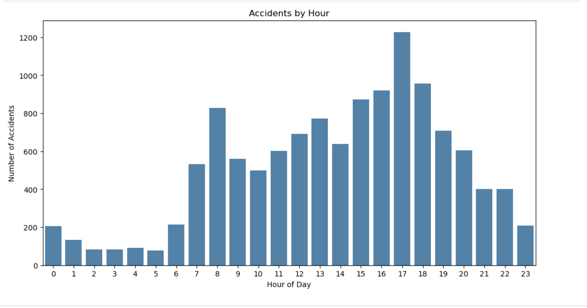
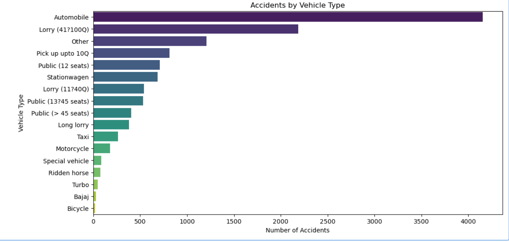
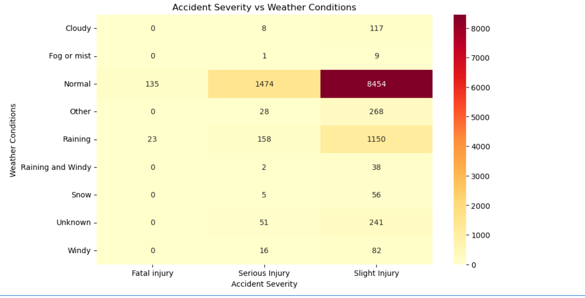
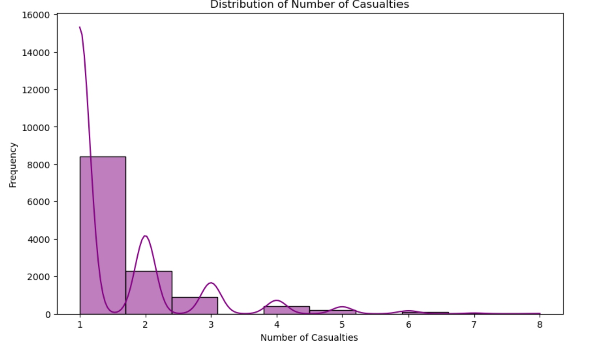

# Road-Traffic-Accident-Analysis-Python
# Road Traffic Accident Analysis using Python

## Project Overview

## Objectives

## Dataset Information

## Technologies Used

## Data Cleaning

## Exploratory Data Analysis

## Statistical Analysis

## Key Insights

## Visualizations

## Project Structure

## How to Run

## Future Improvements

## Author
## Accidents by Hour

## Vehicle Type Distribution

## Correlation Heatmap

## Number of Casualties

